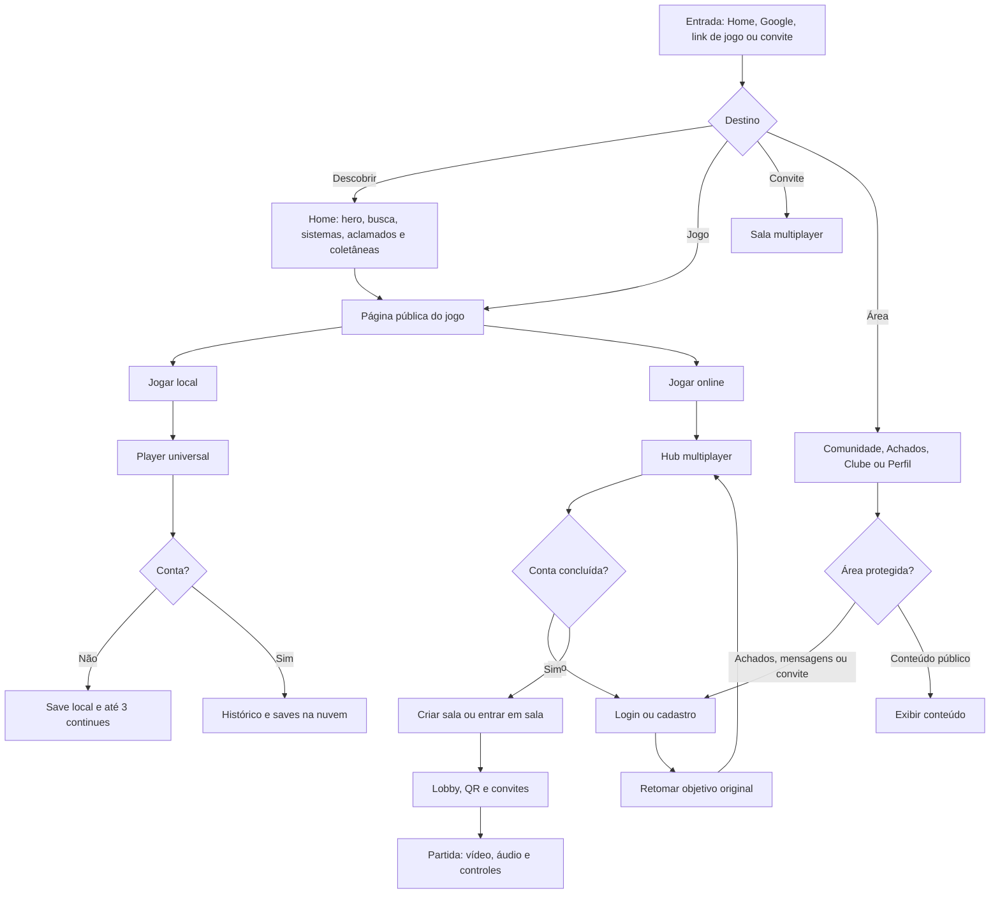

# Fluxo de navegação — NeoTerminalRoom

Atualizado em: 2026-09-01
Commit de referência: atualizar junto à mudança de navegação.

## Contrato de atualização

Sempre que uma rota, gate de autenticação, retorno pós-login, entrada do player ou etapa multiplayer mudar:

1. Atualizar este fluxograma e a data acima.
2. Atualizar `tests/navigation-contract.mjs` e o teste específico da área.
3. Executar `node tests/site-navigation.mjs`.
4. Executar `node tests/navigation-contract.mjs`.
5. Para multiplayer, executar também `node tests/multiplayer-client.mjs` e preencher a matriz de `multiplayer-diagnostics.html` em aparelhos reais.
